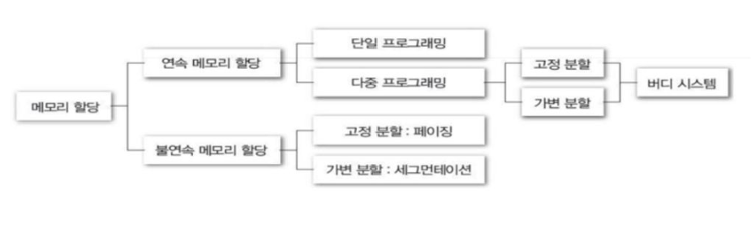
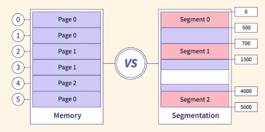

# 메모리 할당

### 메모리 할당이란

메모리 할당은 운영체제가 새 프로세스를 실행 시키거나 실행중인 프로세스가 메모리를 필요로 할때 프로세스에게 물리 메모리를 할당한다. 

운영체제에서도 메모리 할당 기법이 다양하게 있는데 하나씩 알아보자.

  

---

### 연속 메모리 할당

**연속 메모리 할당**은 각 프로세스에게 <u>메모리 한 덩어리씩</u> 할당하는 기법이다. 

할당은 2가지로 고정 크기 할당과 가변 크기 할당이다.

> 고정(정적) 크기 할당 : 메모리 전체를 파티션으로 고정 크기로 나누고 프로세스마다 1개의 파티션

할당된 프로세스가 파티션의 크기보다 작으면 결과적으로 메모리 일부가 낭비된다.

-> 메모리 할당의 유연성 부족 

비어있는 <u>작은 공간을 충분히 활용하지 못하고</u> 적재하지 못하는 경우가 존재한다.

> 가변(동적) 크기 할당 : 프로세스마다 프로세스 크기의 메모리를 할당

고정 크기와 다르게 처음부터 파티션을 나누지 않고 <u>프로세스와 동일한 크기의 메모리 할당</u>

연속 메모리 할당은 프로세스에게 하나의 연속된 메모리를 할당한다.

---

### 분할 메모리 할당(불연속)

**분할 메모리 할당**은 프로세스에게 필요한 메모리를 여러 덩어리로 나누어 분산 할당하는 기법이다.

여기서도 할당은 2가지로 고정 크기 가변 크기 할당으로 분류되는데 특히 <u>세그먼테이션</u>, <u>페이징</u>이라고 불리운다.

 

> 세그먼테이션(가변) : 프로세스를 여러 개의 논리적인 덩어리로 분할. 각 덩어리를 부름

즉 함수, 객체가 하나의 세그먼트일 수 있으며 각 세그먼트들의 <u>크기가 다양하다.</u> 그래서 프로세스들이 실행종료를 반복하게되면 빈 공간이 생겨 메모리 낭비(단편화)가 생긴다.

> 페이징(고정) : 프로세스를 논리적 단위까지 분할하지 않고 페이지라는 고정 크기로 분할한다. 물리 메모리 프레임에 하나씩 분산 할당한다.

결국 페이징은 세그먼테이션의 해결 기법이고 최근엔 페이징 기법을 기반으로 세그먼테이션을 혼합하여 사용한다.

| 메모리 할당 방식     | 연속/불연속 | 홀 발생 여부 | 설명 |
|----------------------|-------------|---------------|------|
| **고정 분할**        | 연속        | ✅ 내부 단편화로 홀 발생 | 프로세스 크기 < 파티션 크기 → 남는 공간 낭비 |
| **가변 분할**        | 연속        | ✅ 외부 단편화로 홀 발생 | 프로세스 종료 후 생긴 공간들이 조각남 |
| **페이징**           | 불연속      | ❌ 거의 없음 | 페이지 크기만큼만 나누기 때문에 내부 단편화는 소량, 외부 단편화는 없음 |
| **세그먼테이션**     | 불연속      | ✅ 외부 단편화로 홀 발생 | 세그먼트 단위 크기가 다양해서 빈 공간이 생김 |

---

### 단편화

분할 메모리 할당에서 세그먼테이션은 결과적으로 메모리 낭비가 발생하는데, 이를 단편화라고 한다.

> 단편화(fragmentation) : 프로세스에게 할당할 수 없는 작은 크기의 조각 메모리들 생기는 현상

또한 조각 메모리를 <u>홀</u>이라고 불리기도 한다.
이렇게 홀의 위치에 따라 단편화가 구분되기도 하는데 내부 단편화와 외부 단편화로 나눠진다.

> 내부단편화 : 파티션 내에 홀 발생

내부단편화는 고정 크기 파티션에서 발생(페이징, 고정분할)

> 외부단편화 : 파티션 사이에 홀 발생

대표적로 가변 크기 파티션 경우 발생(세그먼테이션)

| 구분             | 내부 단편화 (Internal Fragmentation)              | 외부 단편화 (External Fragmentation)              |
|------------------|---------------------------------------------------|----------------------------------------------------|
| 정의             | 할당된 메모리 블록 **내부에 사용하지 못하는 공간** | 메모리 **여러 곳에 생긴 작은 미사용 공간들**      |
| 발생 원인        | 고정 크기 파티션에 작은 프로세스가 들어갈 때      | 프로세스가 종료되거나 이동하면서 생기는 공간들     |
| 주로 발생하는 방식 | 고정 분할, 페이징(소량)                          | 가변 분할, 세그멘테이션                            |
| 공간 재사용      | 어려움 (파티션 내 공간이 낭비됨)                   | 상대적으로 쉬움 (압축(compaction)으로 해결 가능) |
| 예시             | 100KB 파티션에 60KB 프로세스 → 40KB 낭비           | 3개의 빈 공간이 각각 10KB, 20KB, 15KB → 30KB 필요 프로세스는 못 들어감 |

### 연속 메모리 할당 장단점

장점 

- 알고리즘이 단순하여 구현이 용이하다.

- 논리 주소를 물리 주소로 바꾸는 과정이 단순하다. 즉 CPU가 메모리를 액세스하는 속도가 상대적으로 빠름

- 물리 메모리의 시작 위치와 크기 정보만 관리하면 되므로 운영체제 부담이 덜함

단점

- 메모리 할당 유연성이 부족하다. -> 메모리 압축 과정 필요

- 내부 단편화 발생 -> 메모리 낭비

다음은 연속 메모리 할당의 구현을 알아보자.
