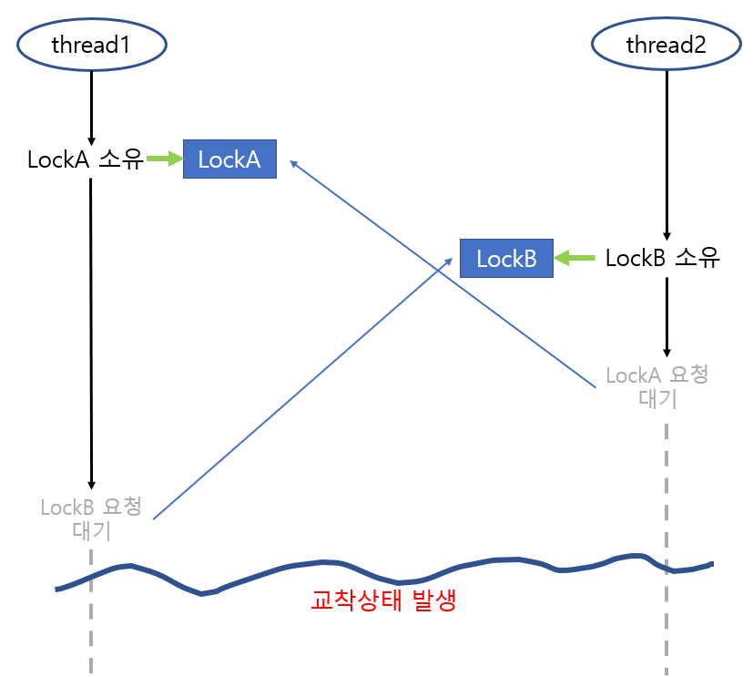

# 은행원 알고리즘

### 은행원 알고리즘 정의

> 은행원 알고리즘은 프로세스가 자원을 요청할때 그 요청을 허용할 경우 시스템이 <u>안전 상태</u>를 유지하는지를 확인한 후 자원을 할당하는 방식이다.

그럼 안전상태를 유지하는 것은 무엇이며,

이전에, 왜 이런 알고리즘이 생겨났는지 알기 위해선 <u>교착상태</u>에 대해 이해할 필요가 있다.

---

### 교착상태 정의

> 교착상태는 자원을 소유한 스레드들 사이에서 각 스레드는 다른 스레드가 소유한 자원을 요청하여 모든 스레드가 <u>무한정 대기</u>하는 현상이다.

짧게 스레드 사이에서 발생하는 공유 자원에 대한 동기화 문제이다.

<p align="center">
 
</p>
위 사진을 보면 두 스레드가 임계구역에 진입하기 위해 2개의 LockA LockB가 필요하다. 하지만, 각 스레드가 락을 하나씩 소유한 상태에서 상대 스레드에게 락을 요청하고 있다.

이런 경우 서로 다른 스레드가 공유자원에 대한 교착상태가 발생하게 된다.

---

### 교착상태 특성

- 교착상태는 CPU의 개수에 상관 없이 발생할 수 있다.

- 교착상태는 커널 코드 내에서는 거의 발생하지 않고 응용 프로그램에서 자주 발생한다.

- 교착상태를 해결하기 위해선 많은 시간과 공간 비용을 치러야한다.

---

### 교착상태의 원인

그렇다면 교착상태가 발생하는 잠재적 요인이 무엇이 있을까?

- <u>**공유자원의 문제**</u>

- <u>**한 스레드가 여러 자원을 동시에 필요로 할때**</u>

- <u>**한 번에 하나씩 자원을 할당하는 OS**</u>

- <u>**자원의 비선점**</u>

> 비선점 : 강제로 빼앗을 수 없다는 것

그렇다면 이러한 교착상태를 해결하는 방법은 무엇이 있을까?

---

### 코프만 조건

교착상태를 해결하기 이전, 코프만이 증명한 교착상태를 발생하는 4가지의 필요충분조건이 존재한다. 

1. **상호배제** - 최소 하나 이상의 자원이 비공유 모드로 점유되어야 한다.
2. **점유하며 대기** - 최소한 자원 하나를 점유한 채, 다른 프로세스에 의해 점유된 자원을 추가로 얻기 위해 대기
3. **비선점** - 점유된 자원은 다른 프로세스에 의해 선점될 수 없다.
4. **환형 대기** - 프로세스들이 체인을 구성하여 자원을 상호 요청함(사이클 형태)

위 4가지 상황을 모두 허용한다면 언제든지 교착상태가 발생한다는 것을 의미한다. 반대로 한 가지라도 성립되지 않는다면 스레드들은 교착상태에 빠지지 않는다.

---

### 교착상태 해결 방법

교착 상태의 해결책은 4가지가 있다.

1. 교착상태 예방 - 코프만의 4가지 조건 중 하나 이상의 조건이 성립되지 못하도록 예방
2. 교착상태 회피 - 교착 상태에 빠지지 않을 것이라고 확신하는 경우에만 자원 할당(은행원 알고리즘)
3. 교착상태 감지 및 복구 - 교착상태에 빠진 스레드 그룹을 발견하면 해체하는 방법
4. 교착상태 무시 - 교착상태가 발생하도록 내버려 두는 방법(타조 알고리즘)

위 해결책중 우리는 교착상태를 회피하기 위한 은행원 알고리즘을 이제 알아보자. 

---

### 교착상태 회피

교착상태의 회피는 자원이 어떻게 사용되는지 추가적인 정보를 제공하도록 요구한다. 각 프로세스는 자신이 필요한 각 유형의 자원들의 최대 수를 선언하도록 한다.

-> 회피는 해당 프로세스 상태가 안정상태인지 불안정상태인지 감별하는 것. <u>물론 불안정 하다고 해서 교착상태가 무조건 발생되는 것은 아니다.</u> 

**우리가 교착상태를 회피하는 이유는 시스템의 불안정 상태를 피하기 위함이라는 것!**

---

### 기본 회피 알고리즘

기본적인 회피 알괴리즘의 예제를 살펴보자.
먼저 12개의 자원과 3개의 프로세스가 존재한다고 하자.

| Process | t0에서 할당량 | Maxeeds | 
|-----|-----|-----|
| p0  | 5  | 10  | 
| p1  | 2  | 4  |
| p2  | 2  | 9  |

현재는 t0에서 할당된 표이다.

위 표를 보면 12개의 자원중 9개의 자원이 할당되어 현재 <u>여유 있는 자원은 3개</u>이다. 왜 t0은 안정상태인지 확인해보자. 

현재 남은 3개의 자원 2개를 먼저 p1에 할당하게 되면 

```
P1 : 2 + 2 = 4 해당 프로세스는 완료되어 1개 / 4개가 남게된다. 이제 P0으로 가보자.

P0 : 5 + 1 + 4 = 10 해당 프로세스도 완료되어 10개가 남는다. 나머지 P2로 가보자.

P2 : 2 + 0 + 10 > 10 이므로 해당 프로세스도 완료된다.
```

이렇게 t0에서 잘 할당된 모습을 보면 교착상태가 일어나지 않고 안정된 상태를 확인가능한데,
<u>만약 다음 t1에서 P2에 1개를 더 할당했다면 어떻게 될까?</u>

| Process | t1에서 할당량 | Maxeeds | 
|-----|-----|-----|
| p0  | 5  | 10  | 
| p1  | 2  | 4  |
| p2  | 3  | 9  |

위 표를 보면 12개 자원중 10의 자원이 할당되어 현재 <u>여유 있는 자원은 2개이다.</u> 그럼 t1은 왜 
불안정상태인데 확인해보자.

현재 남은 2개의 자원을 먼저 똑같히 p1에 할당하게 되면면

```
P1 : 2 + 2 = 4 해당 프로세스는 완료되어 4개가 남게된다.(이전보다 자원1개가 없음) 이제 P0으로 가보자.

P0 : 5 + 4 < 10 결과적으로 Max needs는 10개인데 9개만 가용가능하다. 즉 교착상태가 발생!!
```

<u>기본 회피 알고리즘을 수학적으로 안정성 검사를 거치는 방법이 은행원 알고리즘 방식이다.</u>

---

### 은행원 회피 알고리즘
다시한번 은행원 알고리즘에 대한 정의를 관찰해보자.

> 은행원 알고리즘은 프로세스가 자원을 요청할때 그 요청을 허용할 경우 시스템이 <u>안전 상태</u>를 유지하는지를 확인한 후 자원을 할당하는 방식이다.

예제를 살펴보기 전 개념을 짚어보자.

| 이름 | 의미 |
|-----|-----|
| MAX  | 각 프로세스가 최대로 필요한 자원수  | 
| Allocation  | 현재 할당된 자원 |
| Need  | 더 필요한 자원(MAX - Allocation)|
| Available | 시스템에 남은 자원 |

시각 t0에서 각 프로세스에 할당된 모습이다.

| Process | MAX | Allocation | Available | Need |
|-----|----|-----|----|-----|
|-----| A B C | A B C | A B C | A B C |
| p0  | 7 5 3 | 0 1 0 |       | 7 4 3 |
| p1  | 3 2 2 | 2 0 0 |       | 1 2 2 |
| p2  | 9 0 2 | 3 0 2 | 3 3 2 | 6 0 0 |
| p3  | 2 2 2 | 2 1 1 |       | 0 1 1 |
| p4  | 4 3 3 | 0 0 2 |       | 4 3 1 |

이렇게 프로세스와 자원에 대한 그래프가 주어질때, 가장 먼저 확인해야할 것은 

``` 
조건
Request[i] ≤ Need[i] 인지 확인
→ 요청이 프로세스가 처음에 말한 최대치 이내인가?

Request[i] ≤ Available 인지 확인!!
→ 요청을 당장 줄 수 있는 자원이 있는가?
```

<u>Finish[i] = false 인 프로세스 중에서 Need[i] <= Available 을 만족하는 프로세스를 찾는다.</u>

특정 프로세스가 자원을 요청하는 것은 후에 알아보고, 위의 표가 안정상태인지를 판별하자. 결국 위와 동일함.
P0을 보자. 현재 시스템에 남은 자원은 (3, 3, 2) 인데 Need의 P0을 비교해보면

```
p1 -> p3 -> p4 -> p2 -> p0

P0 : (3 3 2) ≤ (7 4 3) -> (ABC 부족)    ->그럼 P1으로 이동해보자.

P1 : (3 3 2) > (1 2 2) -> 이거는 되겠네! -> p1 해결, 이제 p2로 가보자.(p1 Aollcation 더함)

P2 : (5 3 2) ≤ (6 0 0) -> (A 부족)      -> 그럼 p3로 가보자.

P3 : (5 3 2) > (0 1 1) -> 이거는 되겠네! -> p4로 가보자.

P4 : (7 4 3) > (4 3 1) -> 이거는 되겠네! -> 다시 해결못한 p0으로 가보자.

P0 : (7 4 5) > (7 4 3) -> 이제는 되겠네! -> 마지막 p2로 가보자.

p2 : (10 4 7) > (6 0 0) -> 전부 해결!
```

결과적으로 시스템은 안정이다.(<u> P4 다음에 P0을 가든, P2를 가든 상관없다.</u>)

이제 만약, t1에서 특정 프로세스가 남은 자원을 요청하게되는 경우. 안정상태인지 판별해보자.

<u>p1이 (1, 0, 2)요청했다고 가정해보자.</u>

```
**Q1 : Request1 <= Need1?** 요청이 최대치 이내인가?

(1, 0, 2) <= (1, 2, 2) => TRUE

**Request[i] ≤ Available** 요청이 최대치 이내인가?

(1, 0, 2) <= (3, 3, 2) => TRUE
```
2개의 조건을 확인한다음 위처럼 다시 검사하면 최종적으로 안정성을 띄는지 확인하면된다.

<u>p4이 (3, 3, 0)요청했다고 가정해보자.</u>

```
**Q1 : Request1 <= Need1?** 요청이 최대치 이내인가?

(3, 3, 0) <= (0, 1, 1) => FALSE

**Request[i] ≤ Available** 요청이 최대치 이내인가?

(3, 3, 0) <= (3, 3, 2) => TRUE
```
위 P4는 가용자원이 모자람으로 P4에 할당하면 불안전 상태가 된다.

그럼 <u>p0이 (0, 2, 0)요청했다고 가정해보자.</u>
확인해보면 위 2개의 조건을 만족하는데, 검사해보면 불완전상태임을 확인할 수 있다. 왜냐하면

P0에 더 할당되어 표가 바뀐다.
| Process | MAX | Allocation | Available | Need |
|-----|----|-----|----|-----|
|-----| A B C | A B C | A B C | A B C |
| p0  | 7 5 3 | 0 3 0 |       | 7 2 3 |
| p1  | 3 2 2 | 2 0 0 |       | 1 2 2 |
| p2  | 9 0 2 | 3 0 2 | 3 1 2 | 6 0 0 |
| p3  | 2 2 2 | 2 1 1 |       | 0 1 1 |
| p4  | 4 3 3 | 0 0 2 |       | 4 3 1 |

여기서 각 프로세스를 Available과 Need를 비교해보면 전부 어느하나 프로세스가 실행 불가능을 볼 수 있다.
